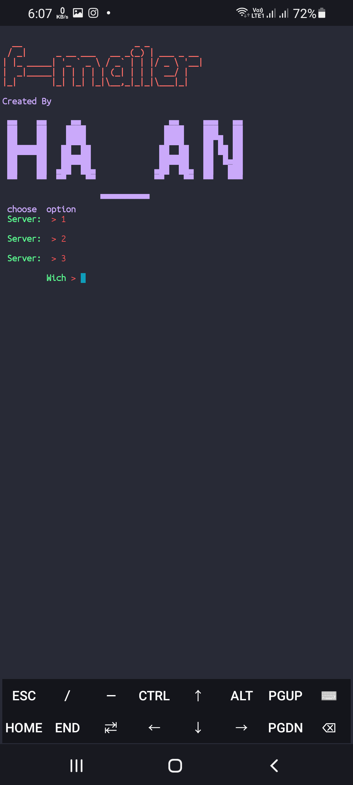

<a href="https://github.com/Kamanati/f-mailer">f-mailer</a>

<a href="https://instagram.com/hasanfq6?igshid=YmMyMTA2M2Y=" rel="nofollow"></a>

</p>

<p align="center">
  
  
  
  
  
</p>

<p align="center">


</p>


## INSTALL: 

```bash
     LINUX AND TERMUX ARE THE SAME

# In the directory where we want to clone the repository:
$ git clone https://github.com/kamanati/f-mailer

# Enter in the directory that makes:
$ cd f-mailer

# we give execution permissions:
$ chmod +x *

# Finally execute the script:

# Linux
$ ./f-mailer.sh

# Termux
$ bash f-mailer.sh
```
### screenshot 1

 

### screenshot 2
 
### Find Me on :

<p align="left">

<a href="https://github.com/Kamanati/f-mailer" target="_blank"></a>

<a href="https://instagram.com/hasanfq6?igshid=YmMyMTA2M2Y=" target="_blank"></a>

<a href="https://chat.whatsapp.com/Iz7ZtwNIWMAFv6Q6hS317M" target="_blank"></a>


</p>
